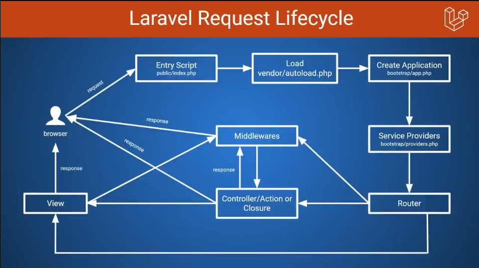

# Laravel Essentials Guide

## **1. Important Artisan Commands**

Laravel comes with a powerful command-line interface called **Artisan**. Here are some essential commands:

### **Common Commands**
```bash
# Create a new model, controller, migration, factory, etc.
php artisan make:model ModelName -m # Model with migration
php artisan make:controller ControllerName --resource # Resource controller
php artisan make:migration create_table_name_table # Migration
php artisan make:seeder SeederName # Database seeder
php artisan make:factory FactoryName --model=ModelName # Factory for testing
```

### **Database & Migrations**
```bash
# Run migrations
php artisan migrate

# Rollback last migration
php artisan migrate:rollback

# Refresh all migrations (rollback + re-run)
php artisan migrate:refresh
```

### **Configuration & Cache**
```bash
# Clear configuration cache
php artisan config:clear

# Cache configuration for performance
php artisan config:cache
```

### **Queue & Background Jobs**
```bash
# Run queued jobs
php artisan queue:work
```

### **Other Useful Commands**
```bash
# List all available Artisan commands
php artisan list

# Serve the application locally
php artisan serve
```

---

## **2. Laravel Request Lifecycle**



A request in Laravel follows this process:
1. **Public/index.php** – The entry point of the application.
2. **HTTP Kernel** – Handles the request and runs middleware.
3. **Routing** – Routes the request to a controller or closure.
4. **Controller** – Processes the request and interacts with models.
5. **Model & Database** – Fetches data using Eloquent ORM.
6. **View (Blade Templates)** – Renders the response.
7. **Response** – Sends output to the client.

---

## **3. Configuration Management**

### **Publishing Configuration Files**
```bash
php artisan vendor:publish --tag=config
```
You can select specific configuration files to publish or publish all available configurations.

### **Updating `.env` File**
Environment-specific settings should be stored in `.env`.
```env
APP_NAME=LaravelApp
DB_CONNECTION=mysql
DB_HOST=127.0.0.1
DB_DATABASE=laravel_db
DB_USERNAME=root
DB_PASSWORD=secret
```
Reload configuration after changes:
```bash
php artisan config:clear
```

---

## **4. Routing & Controllers**

### **Basic Routing**
```php
Route::get('/home', function () {
    return view('home');
});
```

### **Route with Controller**
```php
Route::get('/users', [UserController::class, 'index']);
```

### **Resourceful Routing**
```php
Route::resource('posts', PostController::class);
```
This generates RESTful routes for CRUD operations.

---

## **5. Middleware**
Middleware filters incoming HTTP requests. Example:

### **Creating Middleware**
```bash
php artisan make:middleware CheckAge
```

### **Using Middleware**
```php
public function handle($request, Closure $next)
{
    if ($request->age < 18) {
        return redirect('home');
    }
    return $next($request);
}
```
Register middleware in `app/Http/Kernel.php`.

---

## **6. Eloquent ORM (Database Handling)**

### **Defining a Model**
```php
class Post extends Model
{
    protected $fillable = ['title', 'content'];
}
```

### **Fetching Data**
```php
$posts = Post::all(); // Get all records
$posts = Post::where('published', true)->get(); // Filtered records
```

### **Inserting Data**
```php
Post::create([ 'title' => 'New Post', 'content' => 'Laravel is great!' ]);
```

---

## **7. Blade Templating (Views)**
Blade makes templating easy with features like:

### **Displaying Data**
```blade
<h1>{{ $title }}</h1>
```

### **Conditionals**
```blade
@if($user)
    <p>Welcome, {{ $user->name }}</p>
@endif
```

### **Loops**
```blade
@foreach($posts as $post)
    <h2>{{ $post->title }}</h2>
@endforeach
```

---

## **8. API Development with Laravel**

### **API Routes (routes/api.php)**
```php
Route::get('/users', [UserController::class, 'index']);
```

### **Returning JSON Response**
```php
return response()->json(['message' => 'Success']);
```

### **API Resource Controller**
```bash
php artisan make:controller UserController --api
```

---

## **9. Authentication (Laravel Breeze or Jetstream)**
```bash
composer require laravel/breeze --dev
php artisan breeze:install
```
Or for Jetstream:
```bash
composer require laravel/jetstream
php artisan jetstream:install livewire
```

---

## **10. Testing in Laravel**

### **Writing a Test Case**
```php
public function test_homepage_loads()
{
    $response = $this->get('/');
    $response->assertStatus(200);
}
```

Run tests:
```bash
php artisan test
```

---

## **Conclusion**

This document serves as a **quick reference** for Laravel’s essential features. Mastering these concepts will help you transition smoothly from Django to Laravel! 🚀


controllers
components and slots, (commands for creating components)
class components
dealing with data and methods from class based componets in side blade files
